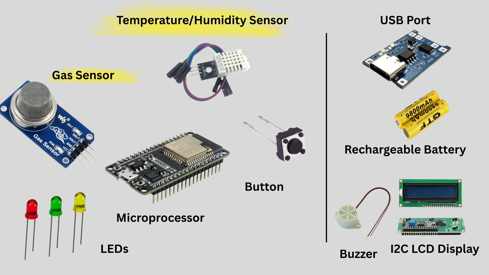
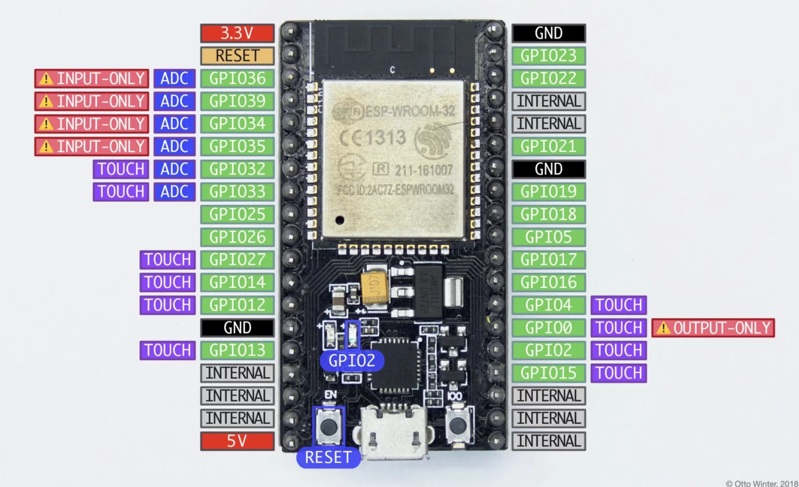
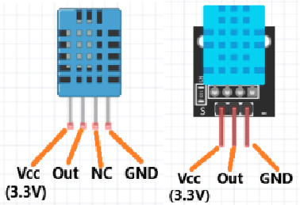

# 🍱 Food Spoilage Monitoring Prototype

This repository contains three versions of a food spoilage monitoring prototype using **ESP32**, **MQ135**, **DHT11**, **FreeRTOS**, and optionally **WiFi/MQTT**. Each version improves upon the previous one in terms of features, connectivity, and energy efficiency.

---
## Notes
- Food type factors are used to adjust sensitivity of MQ135 detection.
- All versions use FreeRTOS tasks to separate LED control and sensor reading.
- V2 is recommended for energy-efficient deployments.

---
## Overview


The system uses **FreeRTOS tasks** to handle concurrency:

- **LED Task:** Handles the sequence of LEDs (Green → Yellow → Red) when the system is turned on via a button.
- **Sensor Task:** Reads sensor values (MQ135, DHT11), calculates spoilage conditions, lights LEDs accordingly, and publishes data to an MQTT broker.

### Key Features

- **Wi-Fi Connection:** Connects ESP32 to a Wi-Fi network.
- **MQTT Communication:** Publishes sensor readings and spoilage state to an MQTT topic `food/monitor`.
- **Button Control:** Toggles the system ON/OFF with a single button.
- **Calibration:** Performs a **5-second baseline calibration** for MQ135 gas sensor before monitoring.
- **LED Indicators:**
  - 🥦 Green → Food is fresh
  - ⚠️ Yellow → Attention / possible spoilage
  - 💀 Red → Spoiled food
- **Spoilage Detection Logic:**
  - Uses MQ135 sensor readings relative to a baseline and thresholds.
  - Considers temperature (`DHT11`) and humidity risks.
  - Adjusts thresholds based on the type of food (POULTRY, DAIRY, FRUITS, etc.).
- **FreeRTOS Implementation:**
  - `taskLED` handles button events and LED sequence.
  - `taskSensors` monitors sensors and publishes MQTT messages.
  - Semaphores ensure safe data sharing between tasks.
- **Energy Management (V2):**
  - Implements awake/sleep cycle: sensor task reads data **only once per activation**, reducing energy consumption.
  - Essential for battery-powered ESP32 and MQTT deployments, avoiding continuous readings and network usage.

---

## Flow of the Code

### Setup Phase (`setup`)
1. Initialize Serial monitor, LEDs, button, sensors, and semaphores.
2. Connect to Wi-Fi and configure MQTT server.
3. Create two FreeRTOS tasks: `taskLED` and `taskSensors`.

### Loop Phase (`loop`)
- Maintain MQTT connection and call `client.loop()` for message handling.

### Button ISR
- Triggers the LED sequence and sensor monitoring ON/OFF.

### Sensor Reading & MQTT Publishing
1. Read analog MQ135 value and DHT11 temperature & humidity.
2. Calculate `mqRatio` and `mqDelta` relative to baseline.
3. Determine spoilage status: `FRAIS`, `ATTENTION`, `SPOILED`.
4. Update LED indicators.
5. Publish JSON payload via MQTT:

```json
{
  "state": "FRAIS/ATTENTION/SPOILED",
  "mq": 600,
  "temp": 22.5,
  "hum": 72.0
}
```

<p float="left">
  
  
</p>

## Calibration

**Purpose:** Set a baseline reading for the MQ135 gas sensor in ambient air.  

**Duration:** 5 seconds after the system is turned on.  

**Process:** Read MQ135 repeatedly, calculate the average, store as `baselineMQ`.  

**Why it matters:** Ensures that subsequent sensor readings reflect actual food spoilage, not environmental variations.  

---

## Hardware Components


### Sensors

| Sensor | ESP32 Pin | Notes |
|--------|-----------|-------|
| ✅ MQ135 | AO → 34 | VCC 5V, GND GND |
| ✅ DHT11 | DATA → 4 | VCC 3.3V, GND GND |

### LEDs

| LED | ESP32 Pin | Resistor | Connection |
|-----|-----------|----------|------------|
| Green | 25 | 220Ω | GND |
| Yellow | 26 | 220Ω | GND |
| Red | 27 | 220Ω | GND |

### Button

| Button | ESP32 Pin | Connection |
|--------|-----------|------------|
| Push | GPIO 5 | GND |

- **Breadboard:** used with male/male, male/female, female/female jumper wires.  
- **PlatformIO & USB:** used for programming the ESP32.  

<p float="left">
  
  
  
</p>


---

## Planned Additions

- LCD Display  
- Buzzer  
- USB port & rechargeable battery  

**Future sensors:**

- MQ-137 (NH₃)  
- MH-Z19B (CO₂)  
- TCS3200 (Color/RGB)  
- DS18B20 (Food/contact temperature)  
- pH Sensor  
- e-Nose  
- Biosensors (The future of Food IoT)  

---

## Energy Management

- ESP32 leverages **deep sleep / awake cycles** to save energy.  
- **MQTT** is only used when active → avoids constant network traffic.  
- Essential for **battery-powered prototypes** with multiple sensors.  
- **FreeRTOS tasks** allow parallel processing without blocking the main loop.  

---

## Demo Links
[Food Spoilage Prototype Demo](https://drive.google.com/drive/folders/12Cr1-BCgiZLW0IBSBpdOh_jnsUY-TUoO?usp=sharing)

