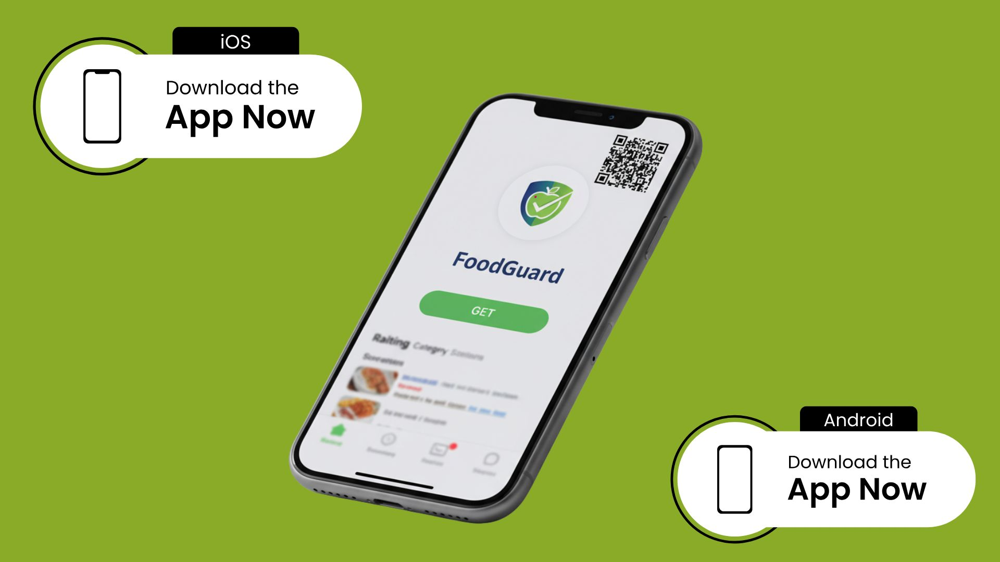

# 🍏 FoodGuard Mobile App Prototype

FoodGuard is a mobile application designed to help users monitor food spoilage, track nutrition, and manage personal health using AI and IoT integration. The app combines personalized recommendations, health tracking, and real-time food monitoring.

---
📱 This is an interactive, animated Figma prototype. The actual mobile app will be developed using React Native to support both iOS and Android, leveraging React Native features such as [insert specific features like navigation, push notifications, camera access, etc.], and will integrate with cloud services and a Python backend to facilitate AI and machine learning functionalities.

## User Flow

### 1. User Registration & Login
- Users can register and log in securely.
- Supports **2-Factor Authentication (2FA)**: verification via email and password for added security.

### 2. Profile Completion
- Upon first login, users complete personal information for personalization:
  - Preferred language
  - Age and sex
  - Lifestyle: Single, Student, Married, Traveller, etc.
  - Country
- This information is used to tailor recommendations and health advice.

### 3. Home Page
- **Nutrition Tips Section:** For each food category, users can find:
  - Spoilage signs
  - Risks and prevention
  - Health information
- **Medical Reports:** Users can import or describe health conditions such as:
  - Diabetes
  - Blood pressure issues
  - Heart conditions
  - Allergies
- **Health Report Generation:** Summarizes user's health status based on inputs.
- **Health Plans:** Personalized exercise routines and diet recommendations.
- **AI Chatbot:** Provides answers and guidance based on the user’s health and profile.

### 4. Food Scan
The app provides four types of scans:
1. **IoT Device Integration:** Connects FoodGuard IoT devices to display real-time readings:
   - Temperature
   - Humidity
   - Gas levels
   - Spoilage status: Fresh / Warning / Spoiled
   - Recommendations and advice
2. **Camera Scan:** Analyzes visual appearance and color of food to detect spoilage.
3. **QR & Barcode Scan:** Identifies packaged food items and provides relevant spoilage information.
4. **History & Tracking:** Users can review past scans and track food conditions over time.

### 5. Additional Features
- Profile editing
- Dark/Light mode
- Premium subscription: Monthly / Yearly
- Logout functionality

---

## Demo Links
You can try the demo or view app screenshots here:  
[FoodGuard Mobile App Demo](https://jolly-crate-87837277.figma.site/)
[FoodGuard Mobile App Demo Video](https://drive.google.com/file/d/1zb3B9qFzPzsq3sQWH4L7VlPLXgxwMqIA/view?usp=sharing)

---

